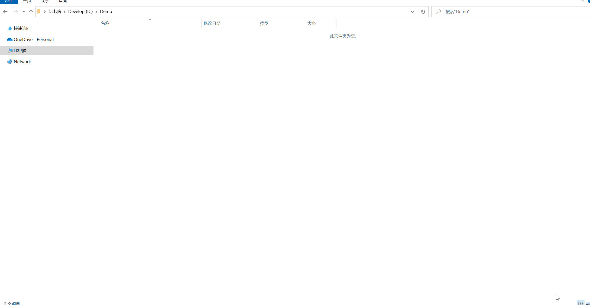

<h1 align="center">
  
<br>
MKH
</h1>

<p align="center">
  <a href="https://github.com/17MKH/Mkh/blob/main/LICENSE"></a>
  <a href="https://www.nuget.org/packages/Mkh.Host.Web/"></a>
  <a href="https://www.npmjs.com/package/mkh-ui"></a>
</p>
<p align="center">业务模块化快速开发框架</p>
<p align="center">开箱即用、专注业务、高效开发、模块复用</p>
<p align="center">一天一模块、三天一系统、拒绝加班、放飞自我</p>
<p align="center">用代码改变世界</p>

## 功能

* 

## 技术栈

> IDE

[Visual Studio 2022](https://visualstudio.microsoft.com/zh-hans/downloads/)、[Visual Studio Code](https://code.visualstudio.com/)

> 后端

 [.Net 6](https://dotnet.microsoft.com/download)、[Dapper](https://github.com/StackExchange/Dapper)、[Serilog](https://serilog.net/)、[AutoMapper](https://automapper.org/)、[Swagger](https://element-plus.gitee.io/)

> 前端

 [Node.js 16+](https://nodejs.org/en/)、[Vue.js 3](https://cn.vuejs.org/)、[Vite](https://cli.vuejs.org/zh/guide/)、[Vuex](https://vuex.vuejs.org/zh/)、[VueRouter](https://router.vuejs.org/zh/)、[Element-Plus](https://element.eleme.cn/#/zh-CN/component/installation)


## 快速开始

安装脚手架MKH CLI：

````bash
> dotnet tool install --global Mkh.Tools.CLI
````

更新脚手架MKH CLI：

````bash
> dotnet tool update --global Mkh.Tools.CLI
````

创建一个模块：

````bash
> mkh new
````

